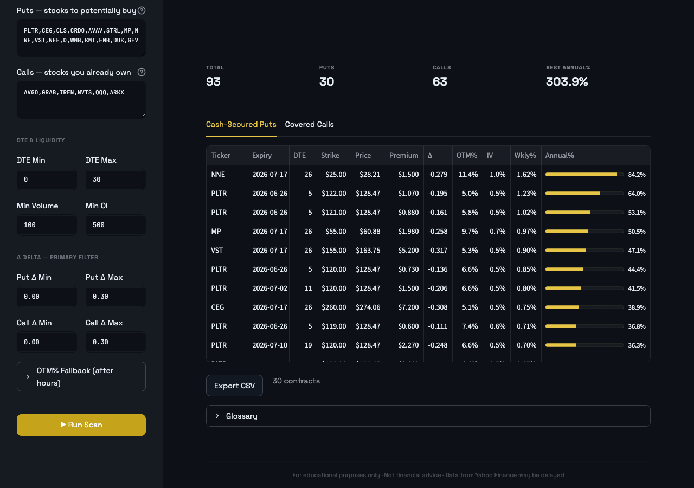

# Options Screener

A local Streamlit dashboard for screening options contracts — cash-secured puts to sell, covered calls to sell, or directional calls/puts to buy.



## What it does

Two screener modes:

**Income Screener** — finds options to sell for recurring premium income:
- **Cash-secured puts**: 0–30 DTE, delta 0.12–0.30, ranked by annualized yield on collateral
- **Covered calls**: same parameters on stocks you already own

**Buy Screener** — finds options to buy for directional positions:
- **Bullish calls**: high-delta (0.40+) calls ranked by composite buy score
- **Bearish puts**: same, for short bias

Data is fetched live from Yahoo Finance (yfinance). Greeks are computed via Black-Scholes (py_vollib). Annualized return is the primary sort metric for income; a composite score (delta × 100 + volume ÷ 100 + open interest ÷ 1000) for buy strategies. The `Annual%` column renders as a progress bar, making the best contracts instantly scannable.

## Architecture

```
dashboard.py                          ← Streamlit entry point
config.yaml                           ← runtime defaults (tickers, filters)
backend/src/wtf_options/
    services/options_service.py       ← core screener logic
    utils/market_data.py              ← yfinance, py_vollib, Black-Scholes Greeks
k8s/                                  ← Kubernetes manifests (k3s via k3s-dev)
Dockerfile.dashboard                  ← container image
tasks.py                              ← invoke task runner
```

All data is fetched at scan time — no database, no caching. The app is stateless.

## Local dev

```bash
# one-time
uv venv --python 3.13
uv sync --all-groups

# run
uv run inv run          # http://localhost:8501
```

Adjust default tickers and filter ranges in `config.yaml` — no code change needed.

## Configuration

`config.yaml` holds all runtime defaults. Edit this file (or the `k8s/configmap.yaml` equivalent in k3s) to change tickers and filter thresholds without rebuilding:

```yaml
screener:
  income:
    put_tickers: "PLTR,CEG,CLS,..."    # stocks to sell puts on
    call_tickers: "QQQ,ARKX,..."       # stocks you own (covered calls)
  buy:
    tickers: "PLTR,CEG,..."

filters:
  dte_min: 0
  dte_max: 30
  put_delta_min: 0.0
  put_delta_max: 0.30
  # ... see config.yaml for full list
```

## k3s deployment

Prerequisites: [k3s-dev](https://github.com/prafful13/k3s-dev) installed, Rancher Desktop running.

```bash
# 1. bootstrap namespace (one-time)
uv run inv bootstrap          # → k3s-dev namespace add contracts-analysis

# 2. build image and load into k3s
uv run inv docker-build       # → docker build + docker save | k3s ctr images import

# 3. deploy
uv run inv k8s-apply          # → kubectl apply -f k8s/
uv run inv k8s-status

# open http://localhost:30502
```

### Manifests

| File | Purpose |
|------|---------|
| `k8s/configmap.yaml` | Default tickers + filters (editable without rebuild) |
| `k8s/deployment.yaml` | Single-replica pod, readiness + liveness probes |
| `k8s/service.yaml` | NodePort 30502 → pod:8501 |

The namespace (`contracts-analysis`) is created and tracked by k3s-dev via `inv bootstrap` — not owned by this repo.

### Update cycle

```bash
uv run inv docker-build && uv run inv k8s-restart
```

## Invoke tasks

| Task | Purpose |
|------|---------|
| `uv run inv run` | Start locally (port 8501) |
| `uv run inv bootstrap` | Provision k3s namespace via k3s-dev (one-time) |
| `uv run inv docker-build` | Build + load image into k3s containerd |
| `uv run inv k8s-apply` | Apply all k8s manifests |
| `uv run inv k8s-status` | Show pod/service/deploy status |
| `uv run inv k8s-logs` | Stream pod logs |
| `uv run inv k8s-restart` | Rolling restart |
| `uv run inv lock-update` | Regenerate `requirements.lock` |

## Tech stack

| Layer | Choice |
|-------|--------|
| UI | Streamlit 1.44+ (dark theme, amber accent) |
| Data | yfinance — Yahoo Finance API |
| Greeks | py_vollib — Black-Scholes analytical |
| Config | PyYAML |
| Container | python:3.13.5-slim + uv |
| Cluster | k3s (Rancher Desktop), namespace via k3s-dev |

---

> **Disclaimer:** For educational and informational purposes only. Not financial advice. Data from Yahoo Finance may be delayed.
