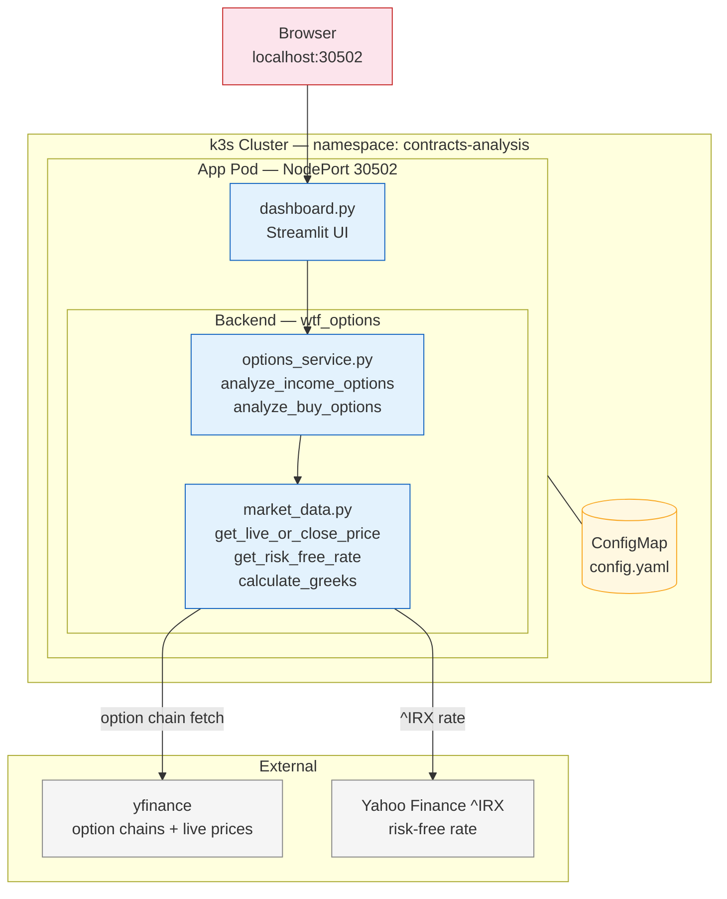

# contracts-analysis — Architecture

**Legend**
- Light grey — external data sources (yfinance, Treasury yield)
- Blue — application components (Streamlit UI + wtf\_options backend)
- Yellow — k8s config
- Pink — end-user entry point

**Data flow:** User selects tickers and strategy filters → Streamlit calls options\_service → market\_data fetches live/close prices and ^IRX rate from yfinance → py\_vollib computes Greeks → filtered contracts returned to dashboard.
